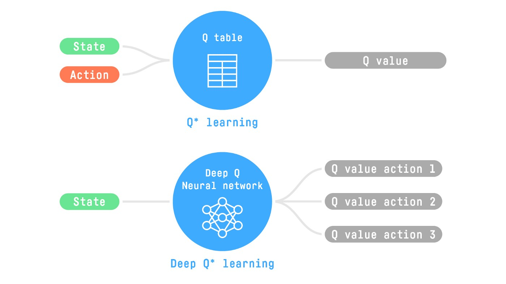
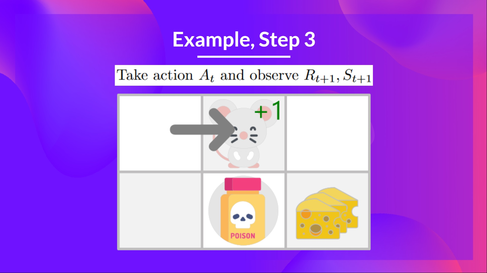
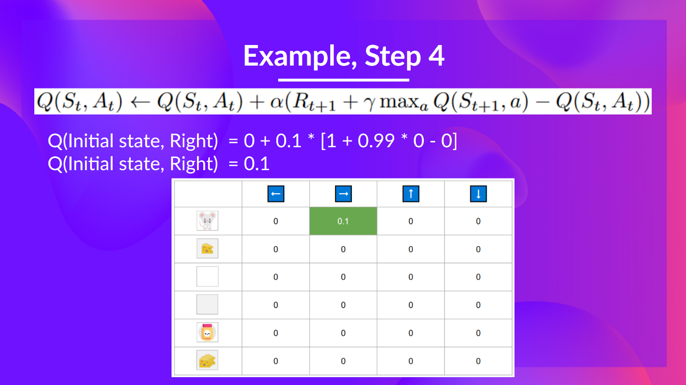
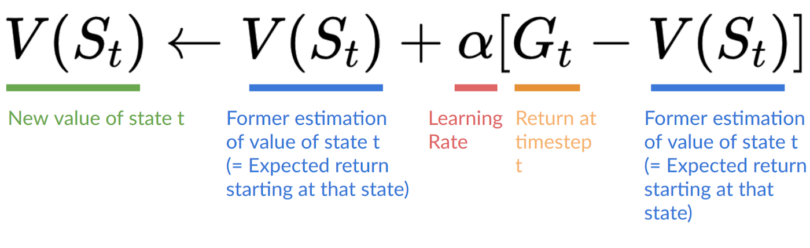

# Hugging Face Deep Reinforcement Learning Course
RL - agent learns how to behave by performing actions in an environment and being evaluated
## What is RL
An Ai agent that learns from an environment like humans. Meaning from natural experiences, like learning how to play a game through trial and error. RL problems can be formulated as a maximization of cumulative reward/return.

_"Reinforcement learning is a framework for solving control tasks (also called decision problems) by building agents that learn from the environment by interacting with it through trial and error and receiving rewards (positive or negative) as unique feedback."_

<p align="center">
  
</p>

<div align='left'>
<em>
S - state: complete description of the state of the world (there is no hidden information)</br>
A - action</br>
R - reward</br>
</br>
Observation is a partial description of the state.</br>
Action space is the set of all possible actions in an environment (discrete space e.g. left|right|up|down, continuous space - infinite)</br>
Reward is the only feedback for the agent, cumulative reward can be written as: R(T) = r<sub>t+1</sub> + r<sub>t+2</sub> + ...</br>
However in reality we cannot add the rewards like that, because some rewards may be more obvious e.g. right in front of us and some may be less obvious (discounted rewards) e.g. we need to jump over a fence first to get 3x</br>
To discount the rewards we proceed like:</br>
1. we define a discount rate called gamma ∈ [0,1], mostly ~0.95. The larger the gamma the more our agent cares for long term rewards.</br>
2. Each reward will be discounted by gamma<sup>time step</sup>. As the time step increases it is less likely to get the long-term reward.</br>

R(T) = r<sub>t+1</sub> + γr<sub>t+2</sub> + γ<sup>2</sup>r<sub>t+3</sub> + ...</br>
</em></br>
The agent's goal is to maximize the cumulative reward.

## Markov property
RL process in papers is called Markov Decision Process (MDP). Markov property implies that the agent requires only the current state to decide what action to take.

## Type of tasks
Episodic | Continuing

### Episodic
We have a starting point and an ending point (terminal space). This creates an episode: a list of states, actions, rewards and sew states e.g. you start somewhere and end when you are killed or reach the end.

### Continuing
There is no terminal space. We must learn how to choose the best actions and simultaneously interact with the environment.

## Exploration/Exploitation trade-off
- exploration - we do random actions to find more info about the environment
- exploitation - we exploit what we know

## Solving RL problems
### The Policy π: the agent’s brain
The policy (π) is the brain of our Agent, it is the function that tells us what action to take given our current state.

state -> π(state) -> action

The policy is the function, our goal is to find the optimal policy π* and we do this through training. We can do this:
- directly - by teaching the agent to learn which action to take given state (policy-based methods)
- indirectly - by teaching the agent to learn which state is more valuable and then take the action that leads to the more valuable state (value-based method)

### Policy-based method
A mapping from each state to the best corresponding action. Alternatively a probability distribution ovet the set of possible actions at that state.

<p align="center">
  
</p>

#### Deterministic policy
A policy at a given state will always return the same action
a = π(S)

#### Stochastic policy
Outputs of a probability distribution over actions
π(a|S) = P[A|S] (prob. dist. over the set of actions, given state S)

S -> π(A|S) -> [left:0.1, right:0.7, up:0.2]

### Value-based methods
Instead a policy function we learn a value function that maps the state of the expected value of being at that state.
The value of a state is the expected discounted return the agent can get if it starts in that state, and then acts according to our policy.

<p align="center">
  
</p>

<p align="center">
  
</p>

At each step our policy will select the state with the highest value.

## 'Deep' in RL
Deep RL - deep NNs to solve RL problems.
They are value-based such as: Q-learning and deep Q-learning

The difference being that in the former we use a Q table that helps us to find what action to take, and in the latter we approximate the Q value with a NN.

<p align="center">
  
</p>

## Q-learning
Q-learning is a off-policy based method that uses a TD approach to trian its action-value function:
- off-policy - we only set the values, the policy is e.g. greedy
- value-based method - finds the optimal policy indirectly by training a value or action-value
- TD - updates its action-value function at each step

The "Q" comes from "Quality" (value) of the action at that state.

Value vs reward:
- value of a state or state-action pair is the expected cumulative reward our agent gets if it starts at this state and contiues according to its policy
- reward is the feedback the agent gets from the environment after performing an action

Q-learning is the RL algorithm that trains a Q-function that internally is a Q-table, meaning for all state-action pairs it has a value. After training we have an optimal Q-function -> (optimal Q-table and optimal policy).
In the beginning the Q-table is useless as it given arbitrary values for each state-action pair (mostly we initialize the Q-table as zeros). As the agent explores the environment we update the Q-table which gives a better approximation of the optimal policy.

<p align="center">
  
</p>

### Q-learning algorithm

<p align="center">
  
</p>

- Step 1: initialize Q-table
- Step 2: choose an action using th epsilon-greedy strategy
- Step 3: perform an action, get the reward and the next step
- Step 4: update Q(S<sub>t</sub>, A<sub>t</sub>), for action-state pair the equation turns out to be:

<p align="center">
  
</p>

We say that Q-learning is an off-policy algorithm because we only greedy-search to get the highest value of the best action of the next state.

#### Off-policy vs On-policy
- Off-policy - different action for acting (inference) and updating (training)
- On-policy - the same policy for acting and updating. For instance "Sarsa" (value-based algorithm) uses the epsilon-greedy policy to get the value of the next step

<p align="center">
  
</p>

### Q-learning example
#### Game rules

<p align="center">
  
</p>
If we take >5 steps or eat the big pile of cheese we end the game.

#### Step 1
Initialize Q-table

<p align="center">
  
</p>

#### Step 2
As we don't have any info abour the environment the the epsilon at the beginning is high we explore (select a random function)

<p align="center">
  
</p>

#### Step 3
We ate the small cheese and get the reward R<sub>t+1</sub> and procede to the new state

<p align="center">
  
</p>

#### Step 4
We update the Q(S<sub>t</sub>, A<sub>t</sub>) using the formula

<p align="center">
  
</p>

#### Step 5
Choose another action (we also decay the epsilon)

<p align="center">
  
</p>

Our reward is very negative as we ate poison and died R<sub>t+1</sub> = -10

#### Step 6
We update the Q(S<sub>t</sub>, A<sub>t</sub>)

<p align="center">
  
</p>

Because we died we start a new episode, but our agent has become smarter.

### Summary
- policy-based methods - the policy is trained with a NN to select what action to take given a state. In this case it is the NN that tells the agent what to do, depending on past experience
- value-based methods - the value function is trained to output the value of a state or a state-action pair that will represent our policy. However this value doesn't define what action the agent should take, instead we need to specify the agent's behaviour based on the values, for instance greedy

### Recap
#### Policy-based methods
Directly train the policy to select what action to take given a state (we don't have a value function) - we don't define by hand the behaviour of our policy, the training will define it.
#### Value-based methods
Indirectly by training a value function that outputs the value of a state or a state-action pair. Given this value function, our policy will take action. Since it is not trained/learnt we will need to specify its behaviour e.g. Greedy Policy.

Consequently whatever method we will use we will need to specify the policy. In case of value-based methods we don't train it, instead we have a pre-specified function

There are 2 types of value-based methods:
- State-value function
<p align="center">
  
</p>
<p align="center">
  
</p>

For each state the state-value function outputs the expected return if the agent starts at that state and then follows the policy.

- Action-value function
<p align="center">
  
</p>
<p align="center">
  
</p>
For each state and action pair the state-value function outputs the expected return of the agent starts in that state, takes that action and then follows the policy.

The difference between the 2 being:
- for state-value for each state we calculate the value of the state S<sub>t</sub>
- for the action-value we calculate the value of the state-action pair (S<sub>t</sub>, A<sub>t</sub>) hence the value of taking that action at that state

But to calculate each value of state or state-action pair we need to sum all the rewards an agent can get if it starts at that state, this can be computationally expensive, and that's why we use the Bellman's equation.

### Bellman equation
It simplifies the state or state-action value calculation. We generally need to calculate the value of state V(S<sub>t</sub>) for each step based on the previous ones V(S<sub>t-1</sub>). The Bellman equation is a recursive equation that works like: instead of starting for each state from the beginning and calculating the return, we can consider the value of any state as the immediate reward V(S<sub>t</sub>) = R<sub>t+1</sub> + the discounted value of the state that follows γ∗V(S<sub>t+1</sub>)

So instead of doing this:
<p align="center">
  
</p>
We do this:
<p align="center">
  
</p>

##### Epsilon-Greedy Policy

<p align="center">
  
</p>

With ϵ = 1 meaning that the probability of exploration is maximum. At the beginning the probability of exploration will be the highest, but as the Q-table gets better we will reduce the ϵ since we don't need to explore as much.

<p align="center">
  
</p>


### Monte Carlo vs Temporal Difference Learning
MC and Temporal Difference Learning are two different strategies on how to train our value or policy function. Both of them use experience to solve the RL problem.

#### Monte Carlo
Uses the entire episode of experience for learning. At the end of the episode it calculate G<sub>t</sub> (return) and uses to as a target to update V(S<sub>t</sub>).
E.g. :
- we always start at the same point
- the agent takes actions using a policy e.g. Greedy
- we get the reward and the next state
- we terminate the game at some timestep
- at the end we will have a list of S,A,R and the next state
- the agent will sum the rewards G
- and then update V based on the formula

<p align="center">
  
</p>

- we start a new game

If we train a state-value function using MC:

- we initialize a function so that it returns 0 for each state
- we set the _lr_ to be e.g. 0.1 and the _discount rate_ to be e.g. 1
- our agent explores the environment and takes actions
- we end the game at some point
- we calculate the return G
- we compute the new V

<p align="center">
  
</p>

<p align="center">
  
</p>

#### Temporal Difference Learning (TD)
Uses only a step (S<sub>t</sub>,A<sub>t</sub>,R<sub>t+1</sub>,S<sub>t+1</sub>) to learn. Consequently we learn at each step by forming a TD target from S(<sub>t+1</sub>)

We update V(S<sub>t</sub>) at each step. But because we didn't experience the entire episode we don't have G<sub>t</sub>, we estimate it by adding R<sub>t+1</sub>and the discounted value of the next state.
This is called bootstrapping because TD bases its update on the existing estimate V(<sub>t+1</sub>) and not a complete sample G.

E.g.
- we initialize our function to return 0 at each state
- Our lr is e.g. 0.1 and our discount rate is 1
- the agent explores the environment by going left
- it gets a reward R<sub>t+1</sub>
- we now update V(S<sub>0</sub>) as:
  - V(S<sub>0</sub>) = V(S<sub>0</sub>) + lr*[R<sub>1</sub> + У*V(S<sub>1</sub>) - V(S<sub>0</sub>)]
  - V(S<sub>0</sub>) = 0 + 0.1*[1+1*0-0]
  - V(S<sub>0</sub>) = 0.1
- and we continue to interact with the environment

<p align="center">
  
</p>

#### Summary
- MC updates the value function after a complete episode and we use the actual accurate discounted return of the episode.
- TD updates the value function at each step, we replace G - which we don't know - with an extimated return called the TD target.
- there are two types of value-based functions:
  - state-value function - outputs the expected return if the agent starts at a given state and acts according to the policy forever after
  - action-value function - outputs the expected return if the agent starts in a given state, takes a given action at that state and then acts accordingly to the policy forever
- in value-based methods rather than learning the policy we define it by hand and learn a value function.


## Code Overview
### Lunar Lander tutorial
Gymnasium contains training environments and can be used as:
```
import gymnasium as gym

# First, we create our environment called LunarLander-v2
env = gym.make("LunarLander-v3")

# Then we reset this environment
observation, info = env.reset()

for _ in range(20):
    # Take a random action
    action = env.action_space.sample()
    print("Action taken:", action) # 0 | 1 | ...

    # Do this action in the environment and get
    # next_state, reward, terminated, truncated and info
    observation, reward, terminated, truncated, info = env.step(action)

    # If the game is terminated (in our case we land, crashed) or truncated (timeout)
    if terminated or truncated: # truncated is a timelimit or if agent if out of bounds
        # Reset the environment
        print("Environment is reset")
        observation, info = env.reset()

env.close()
```
Example env info and action
```
# We create our environment with gym.make("<name_of_the_environment>")
env = gym.make("LunarLander-v3")
env.reset()
print("_____OBSERVATION SPACE_____ \n")
print("Observation Space Shape", env.observation_space.shape)

# Env variables:

# Horizontal pad coordinate (x)
# Vertical pad coordinate (y)
# Horizontal speed (x)
# Vertical speed (y)
# Angle
# Angular speed
# If the left leg contact point has touched the land (boolean)
# If the right leg contact point has touched the land (boolean)

print("Sample observation", env.observation_space.sample())  # Get an observation for a random acion

# Possible actions:

# Action 0: Do nothing,
# Action 1: Fire left orientation engine,
# Action 2: Fire the main engine,
# Action 3: Fire right orientation engine.
```
Stack environments
```
env = make_vec_env("LunarLander-v2", n_envs=16)
```
Train a model
```
# Create environment
env = gym.make('LunarLander-v3')

# Instantiate the agent
model = PPO(
    policy="MlpPolicy",
    env=env,
    n_steps=1024,
    batch_size=64,
    n_epochs=4,
    gamma=0.999,
    gae_lambda=0.98,
    ent_coef=0.01,
    verbose=1,
)
# Train the agent
model.learn(total_timesteps=int(2e5))
# Save the model
model_name = "ppo-LunarLander-v3"
model.save(model_name)
```
Evaluate a model
```
from stable_baselines3.common.monitor import Monitor

#we need to wrap the env in a monitor
eval_env = Monitor(gym.make("LunarLander-v2"))
mean_reward, std_reward = evaluate_policy(model, eval_env, n_eval_episodes=10, deterministic=True)
print(f"mean_reward={mean_reward:.2f} +/- {std_reward}")
```
Push model to HuggingFace Hub
```
import gymnasium as gym

from stable_baselines3 import PPO
from stable_baselines3.common.vec_env import DummyVecEnv
from stable_baselines3.common.env_util import make_vec_env

from huggingface_sb3 import package_to_hub

env_id = "LunarLander-v2"

model_architecture = "PPO"

repo_id = {User_name}/{repo_name}

## Define the commit message
commit_message = "Upload PPO LunarLander-v2 trained agent"

# Create the evaluation env and set the render_mode="rgb_array"
eval_env = DummyVecEnv([lambda: Monitor(gym.make(env_id, render_mode="rgb_array"))])

package_to_hub(
    model=model,  # Our trained model
    model_name=model_name,
    model_architecture=model_architecture,
    env_id=env_id,
    eval_env=eval_env,
    repo_id=repo_id,
    ppo-LunarLander-v2
    commit_message=commit_message,
)
```
Load from HuggingFace Hub
```
from huggingface_sb3 import load_from_hub

repo_id = "Classroom-workshop/assignment2-omar"  # The repo_id
filename = "ppo-LunarLander-v2.zip"  # The model filename.zip

# When the model was trained on Python 3.8 the pickle protocol is 5
# But Python 3.6, 3.7 use protocol 4
# In order to get compatibility we need to:
# 1. Install pickle5 (we done it at the beginning of the colab)
# 2. Create a custom empty object we pass as parameter to PPO.load()
custom_objects = {
    "learning_rate": 0.0,
    "lr_schedule": lambda _: 0.0,
    "clip_range": lambda _: 0.0,
}

checkpoint = load_from_hub(repo_id, filename)
model = PPO.load(checkpoint, custom_objects=custom_objects, print_system_info=True)

#evaluate
eval_env = Monitor(gym.make("LunarLander-v2"))
mean_reward, std_reward = evaluate_policy(model, eval_env, n_eval_episodes=10, deterministic=True)
print(f"mean_reward={mean_reward:.2f} +/- {std_reward}")
```

### Frozen lake / An autonomous taxi - Q-learning
#### Environments

<p align="center">
  
</p>

#### Code
##### Trick to use virtual screen in google colab
```
import os

os.kill(os.getpid(), 9)
```
```
from pyvirtualdisplay import Display

virtual_display = Display(visible=0, size=(1400, 900))
virtual_display.start()
```
##### Frozen lake
```
import numpy as np
import gymnasium as gym
import random
import imageio
import os
import tqdm

import pickle5 as pickle
from tqdm.notebook import tqdm
```
```
# map_name = "4x4" | "8x8"
# is_slippery = define is we want the lake to be slipprey (agent to have momentum)

env = gym.make("FrozenLake-v1", map_name="4x4", is_slippery=False, render_mode="rgb_array")
```
Creating a custom grid
```
desc=["SFFF", "FHFH", "FFFH", "HFFG"]
gym.make('FrozenLake-v1', desc=desc, is_slippery=True)
```
Observation space
```
print("_____OBSERVATION SPACE_____ \n")
print("Observation Space", env.observation_space)
print("Sample observation", env.observation_space.sample())  # Get a random observation

# the observation space is discreete(16), the observation is an integer representing the agent's current position as cur_row*n_col+corrent_col (col and row start at 0)
```

<p align="left">
  
</p>
E.g. the goal position is 3*4+3=15 (cur_row_index + n_cols + cur_col_index)

Action space
```
print("\n _____ACTION SPACE_____ \n")
print("Action Space Shape", env.action_space.n)
print("Action Space Sample", env.action_space.sample())  # Take a random action

# 0 : left
# 1 : down
# 2 : right
# 3 : up
```
###### Step 1
Initialize Q-table
```
state_space = env.observation_space.n
print("There are ", state_space, " possible states")

action_space = env.action_space.n
print("There are ", action_space, " possible actions")

def initialize_q_table(state_size, action_size):
  qtab = np.zeros((state_size, action_size))
  return qtab

qtab_frozen_lake = initialize_q_table(state_space, action_space)
```
Define (off-policy policy)
```
def greedy(qtab, state):
  action = np.argmax(qtab[state])
  return action
```
Define policy
```
def epsilon_policy(qtab, state, epsi):

  rand_num = np.random.uniform(0,1)
  if random > epsi:
    action = greedy(qtab)
  else:
    action = env.action.space.sample()

  return action
```
Define hyperparams
```
n_epochs = 1e5
lr = 0.5

n_eval = 100

env_id = 'FrozenLake-v1'
max_steps = 99
gamma = 0.95 # discount

max_epsilon = 1.0
min_epsilon = 0.05
epsi_decay = 5e-4
```
Training loop - pseudocode
```
For epoch in total n epochs:

  reduce epsi
  reset env

  for step in max steps:
    choose action according to epsilon policy
    take action (a) and abserve state and reward (s', r)
    update Q-value using Bellman equation: Q(s,a) + lr [R(s,a) + gamma * max Q(s', ') - Q(s,a)]
    if done finish epoch
    next state = new state
```
Train function
```
def train(n_epoch, min_epsi, max_epsi, decay_rate, env, max_steps, qtable):
  for episode in tqdm(range(n_epoch)):
    epsi = min_epsi + (max_epsi - min_epsi)*np.exp(-decay_rate*episode)
    
    state, info = env.reset()
    step=0
    terminated = False
    truncated = False

    for step in range(max_steps):
      action = epsilon_policy(qtable, state, epsi)

      new_state, reward, terminated, truncated, info = env.step(action)

      qtable[state][action] = qtable[state][action] + lr*(reward + gamma * np.max(qtable[new_state]) - qtable[state][action])

      if terminated or truncated:
        break

      state = new_state
  
  return qtable
```
```
qtab_frozen_lake = train(n_epochs, min_epsilon, max_epsilon, epsi_decay, env, max_steps, qtab_frozen_lake)
```
Evaluate agent
```
def eval(env, max_steps, n_eval_epochs, q, seed):
  episode_rewards=[]
  for episode in tqdm(range(n_eval_epochs)):
    if seed:
      state, info = env.reset(seed=seed[episode])
    else:
      state, info = env.reset()

    step=0
    truncated=False
    terminated=False
    total_rewards_ep=0

    for step in range(max_steps):
      action = greedy_policy(q, state)
      new_state , reward, terminated, truncated, info = env.step(action)
      total_rewards_ep += reward

      if terminated or truncated:
        break

      state = new_state

    episode_rewards.append(total_rewards_ep)

  mean_reward = np.mean(episode_rewards)
  std_reward = np.std(episode_rewards)

  return mean_reward, std_reward
```
```
mean_reward, std_reward = evaluate_agent(env, max_steps, n_eval_epochs, qtab_frozen_lake, eval_seed)
print(f"Mean_reward={mean_reward:.2f} +/- {std_reward:.2f}")
```
Push model to HF hub
```
from huggingface_hub import HfApi, snapshot_download
from huggingface_hub.repocard import metadata_eval_result, metadata_save

from pathlib import Path
import datetime
import json

def record_video(env, Qtable, out_directory, fps=1):
    """
    Generate a replay video of the agent
    :param env
    :param Qtable: Qtable of our agent
    :param out_directory
    :param fps: how many frame per seconds (with taxi-v3 and frozenlake-v1 we use 1)
    """
    images = []
    terminated = False
    truncated = False
    state, info = env.reset(seed=random.randint(0, 500))
    img = env.render()
    images.append(img)
    while not terminated or truncated:
        # Take the action (index) that have the maximum expected future reward given that state
        action = np.argmax(Qtable[state][:])
        state, reward, terminated, truncated, info = env.step(
            action
        )  # We directly put next_state = state for recording logic
        img = env.render()
        images.append(img)
    imageio.mimsave(out_directory, [np.array(img) for i, img in enumerate(images)], fps=fps)

def push_to_hub(repo_id, model, env, video_fps=1, local_repo_path="hub"):
    """
    Evaluate, Generate a video and Upload a model to Hugging Face Hub.
    This method does the complete pipeline:
    - It evaluates the model
    - It generates the model card
    - It generates a replay video of the agent
    - It pushes everything to the Hub

    :param repo_id: repo_id: id of the model repository from the Hugging Face Hub
    :param env
    :param video_fps: how many frame per seconds to record our video replay
    (with taxi-v3 and frozenlake-v1 we use 1)
    :param local_repo_path: where the local repository is
    """
    _, repo_name = repo_id.split("/")

    eval_env = env
    api = HfApi()

    # Step 1: Create the repo
    repo_url = api.create_repo(
        repo_id=repo_id,
        exist_ok=True,
    )

    # Step 2: Download files
    repo_local_path = Path(snapshot_download(repo_id=repo_id))

    # Step 3: Save the model
    if env.spec.kwargs.get("map_name"):
        model["map_name"] = env.spec.kwargs.get("map_name")
        if env.spec.kwargs.get("is_slippery", "") == False:
            model["slippery"] = False

    # Pickle the model
    with open((repo_local_path) / "q-learning.pkl", "wb") as f:
        pickle.dump(model, f)

    # Step 4: Evaluate the model and build JSON with evaluation metrics
    mean_reward, std_reward = evaluate_agent(
        eval_env, model["max_steps"], model["n_eval_episodes"], model["qtable"], model["eval_seed"]
    )

    evaluate_data = {
        "env_id": model["env_id"],
        "mean_reward": mean_reward,
        "n_eval_episodes": model["n_eval_episodes"],
        "eval_datetime": datetime.datetime.now().isoformat(),
    }

    # Write a JSON file called "results.json" that will contain the
    # evaluation results
    with open(repo_local_path / "results.json", "w") as outfile:
        json.dump(evaluate_data, outfile)

    # Step 5: Create the model card
    env_name = model["env_id"]
    if env.spec.kwargs.get("map_name"):
        env_name += "-" + env.spec.kwargs.get("map_name")

    if env.spec.kwargs.get("is_slippery", "") == False:
        env_name += "-" + "no_slippery"

    metadata = {}
    metadata["tags"] = [env_name, "q-learning", "reinforcement-learning", "custom-implementation"]

    # Add metrics
    eval = metadata_eval_result(
        model_pretty_name=repo_name,
        task_pretty_name="reinforcement-learning",
        task_id="reinforcement-learning",
        metrics_pretty_name="mean_reward",
        metrics_id="mean_reward",
        metrics_value=f"{mean_reward:.2f} +/- {std_reward:.2f}",
        dataset_pretty_name=env_name,
        dataset_id=env_name,
    )

    # Merges both dictionaries
    metadata = {**metadata, **eval}

    model_card = f"""
  # **Q-Learning** Agent playing1 **{env_id}**
  This is a trained model of a **Q-Learning** agent playing **{env_id}** .

  ## Usage

  model = load_from_hub(repo_id="{repo_id}", filename="q-learning.pkl")

  # Don't forget to check if you need to add additional attributes (is_slippery=False etc)
  env = gym.make(model["env_id"])
  """

    evaluate_agent(env, model["max_steps"], model["n_eval_episodes"], model["qtable"], model["eval_seed"])

    readme_path = repo_local_path / "README.md"
    readme = ""
    print(readme_path.exists())
    if readme_path.exists():
        with readme_path.open("r", encoding="utf8") as f:
            readme = f.read()
    else:
        readme = model_card

    with readme_path.open("w", encoding="utf-8") as f:
        f.write(readme)

    # Save our metrics to Readme metadata
    metadata_save(readme_path, metadata)

    # Step 6: Record a video
    video_path = repo_local_path / "replay.mp4"
    record_video(env, model["qtable"], video_path, video_fps)

    # Step 7. Push everything to the Hub
    api.upload_folder(
        repo_id=repo_id,
        folder_path=repo_local_path,
        path_in_repo=".",
    )

    print("Your model is pushed to the Hub. You can view your model here: ", repo_url)
```
```
model = {
    "env_id": env_id,
    "max_steps": max_steps,
    "n_training_episodes": n_training_episodes,
    "n_eval_episodes": n_eval_episodes,
    "eval_seed": eval_seed,
    "learning_rate": learning_rate,
    "gamma": gamma,
    "max_epsilon": max_epsilon,
    "min_epsilon": min_epsilon,
    "decay_rate": decay_rate,
    "qtable": Qtable_frozenlake,
}
```
```
username = #USER_123
repo_name = #frozenlake_best_model
push_to_hub(repo_id=f"{username}/{repo_name}", model=model, env=env)
```

##### Taxi-v3
Initialize Q-table
```
Qtable_taxi = initialize_q_table(state_space, action_space)
print(Qtable_taxi)
print("Q-table shape: ", Qtable_taxi.shape)
```
Define hyperparameters
```
n_training_episodes = 25000
learning_rate = 0.7

n_eval_episodes = 100

eval_seed = [
    16,
    54,
    165,
    177,
    ...
    11,
    28,
    148,
]

env_id = "Taxi-v3"
max_steps = 99
gamma = 0.95

max_epsilon = 1.0
min_epsilon = 0.05
decay_rate = 0.005
```
Train
```
Qtable_taxi = train(n_training_episodes, min_epsilon, max_epsilon, decay_rate, env, max_steps, Qtable_taxi)
```
Push to HF hub
```
model = {
    "env_id": env_id,
    "max_steps": max_steps,
    "n_training_episodes": n_training_episodes,
    "n_eval_episodes": n_eval_episodes,
    "eval_seed": eval_seed,
    "learning_rate": learning_rate,
    "gamma": gamma,
    "max_epsilon": max_epsilon,
    "min_epsilon": min_epsilon,
    "decay_rate": decay_rate,
    "qtable": Qtable_taxi,
}
```
```
username = #USER_123
repo_name = #frozenlake_best_model
push_to_hub(repo_id=f"{username}/{repo_name}", model=model, env=env)
```
Load from HF hub
```
from urllib.error import HTTPError

from huggingface_hub import hf_hub_download


def load_from_hub(repo_id: str, filename: str) -> str:
    """
    Download a model from Hugging Face Hub.
    :param repo_id: id of the model repository from the Hugging Face Hub
    :param filename: name of the model zip file from the repository
    """
    # Get the model from the Hub, download and cache the model on your local disk
    pickle_model = hf_hub_download(repo_id=repo_id, filename=filename)

    with open(pickle_model, "rb") as f:
        downloaded_model_file = pickle.load(f)

    return downloaded_model_file
```
```
model = load_from_hub(repo_id="ThomasSimonini/q-Taxi-v3", filename="q-learning.pkl")  # Try to use another model

print(model)
env = gym.make(model["env_id"])

evaluate_agent(env, model["max_steps"], model["n_eval_episodes"], model["qtable"], model["eval_seed"])
```
```
model = load_from_hub(
    repo_id="ThomasSimonini/q-FrozenLake-v1-no-slippery", filename="q-learning.pkl"
)  # Try to use another model

env = gym.make(model["env_id"], is_slippery=False)

evaluate_agent(env, model["max_steps"], model["n_eval_episodes"], model["qtable"], model["eval_seed"])
```