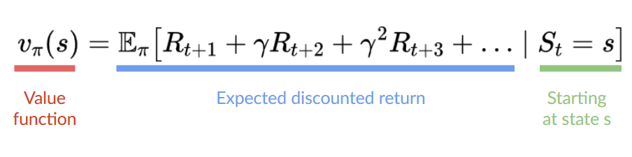

# Hugging Face Deep Reinforcement Learning Course
RL - agent learns how to behave by performing actions in an environment and being evaluated
## What is RL
An Ai agent that learns from an environment like humans. Meaning from natural experiences, like learning how to play a game through trial and error. RL problems can be formulated as a maximization of cumulative reward/return.

_"Reinforcement learning is a framework for solving control tasks (also called decision problems) by building agents that learn from the environment by interacting with it through trial and error and receiving rewards (positive or negative) as unique feedback."_

<p align="center">
  
</p>

<div align='left'>
<em>
S - state: complete description of the state of the world (there is no hidden information)</br>
A - action</br>
R - reward</br>
</br>
Observation is a partial description of the state.</br>
Action space is the set of all possible actions in an environment (discrete space e.g. left|right|up|down, continuous space - infinite)</br>
Reward is the only feedback for the agent, cumulative reward can be written as: R(T) = r<sub>t+1</sub> + r<sub>t+2</sub> + ...</br>
However in reality we cannot add the rewards like that, because some rewards may be more obvious e.g. right in front of us and some may be less obvious (discounted rewards) e.g. we need to jump over a fence first to get 3x</br>
To discount the rewards we proceed like:</br>
1. we define a discount rate called gamma ∈ [0,1], mostly ~0.95. The larget the gamma the more our agent cares for long term rewards.</br>
2. Each reward will be discounted by gamma<sup>time step</sup>. As the time step increases it is less likely to get the long-term reward.</br>

R(T) = r<sub>t+1</sub> + γr<sub>t+2</sub> + γ<sup>2</sup>r<sub>t+3</sub> + ...</br>
</em></br>
The agent's goal is to maximize the cumulative reward.

## Markov property
RL process in papers is called Markov Decision Process (MDP). Markov property implies that the agent requires only the current state to decide what action to take.

## Type of tasks
Episodic | Continuing

### Episodic
We have a starting point and an ending point (terminal space). This creates an episode: a list of states, actions, rewards and sew states e.g. you start somewhere and end when you are killed or reach the end.

### Continuing
There is no terminal space. We must learn how to choose the best actions and simultaneously interact with the environment.

## Exploration/Exploitation trade-off
- exploration - we do random actions to find more info about the environment
- exploitation - we exploit what we know

## Solving RL problems
### The Policy π: the agent’s brain
The policy (π) is the brain of our Agent, it is the function that tells us what action to take given our current state.

state -> π(state) -> action

The policy is the function, our goal is to find the optimal policy π* and we do this through training. We can do this:
- directly - by teaching the agent to learn which action to take given state (policy-based methods)
- indirectly - by teaching the agent to learn which state is more valuable and then take the action that leads to the more valuable state (value-based method)

### Policy-based method
A mapping from each state to the best corresponding action. Alternatively a probability distribution ovet the set of possible actions at that state.

<p align="center">
  
</p>

#### Deterministic policy
A policy at a given state will always return the same action
a = π(S)

#### Stochastic policy
Outputs of a probability distribution over actions
π(a|S) = P[A|S] (prob. dist. over the set of actions, given state S)

S -> π(A|S) -> [left:0.1, right:0.7, up:0.2]

### Value-based methods
Instead a policy function we learn a value function that maps the state of the expected value of being at that state.
The value of a state is the expected discounted return the agent can get if it starts in that state, and then acts according to our policy.

<p align="center">
  
</p>

<p align="center">
  
</p>

At each step our policy will select the state with the highest value.

## 'Deep' in RL
Deep RL - deep NNs to solve RL problems.
They are value-based such as: Q-learning and deep Q-learning

The difference being that in the former we use a Q table that helps us to find what action to take, and in the latter we approximate the Q value with a NN.

<p align="center">
  
</p>

## Q-learning
### Recap
#### Policy-based methods
Directly train the policy to select what action to take given a state (we don't have a value function) - we don't define by hand the behaviour of our policy, the training will define it.
#### Value-based methods
Indirectly by training a value function that outputs the value of a state or a state-action pair. Given this value function, our policy will take action. Since it is not trained/learnt we will need to specify its behaviour e.g. Greedy Policy.

Consequently whatever method we will use we will need to specify the policy. In case of value-based methods we don't train it, instead we have a pre-specified function

There are 2 types of value-based methods:
- State-value function
<p align="center">
  
</p>
<p align="center">
  
</p>

For each state the state-value function outputs the expected return if the agent starts at that state and then follows the policy.

- Action-value function
<p align="center">
  
</p>
<p align="center">
  
</p>
For each state and action pair te state-value function outputs the expected return of the agent starts in that state, takes that action and then follows the policy.

The difference between the 2 being:
- for state-value for each state we calculate the value of the state S<sub>t</sub>
- for the action-value we calculate the value of the state-action pair (S<sub>t</sub>, A<sub>t</sub>) hence the value of taking that action at that state

But to calculate each value of state or state-action pair we need to sum all the rewards an agent can get if it starts at that state, this can be computationally expensive, and that's why we use the Bellman's equation.

### Bellman equation
It simplifies the state or state-action value calculation. We generally need to calculate the value of state V(S<sub>t</sub>) for each step based on the previous ones V(S<sub>t-1</sub>). The Bellman equation is a recursive equation that works like: instead of starting for each state from the beginning and calculating the return, we can consider the value of any state as the immediate reward V(S<sub>t</sub>) = R<sub>t+1</sub> + the discounted value of the state that follows γ∗V(S<sub>t+1</sub>)

So instead of doing this:
<p align="center">
  
</p>
We do this:
<p align="center">
  
</p>

##### Epsilon-Greedy Policy
--TO BE FINSHED--

### Monte Carlo vs Temporal Difference Learning
MC and Temporal Difference Learning are two different strategies on how to train our value function. Both of them use experience to solve the RL problem.

#### Monte Carlo
Uses the entire episode of experience for learning. At the end of the episode it calculate G<sub>t</sub> (return) and uses to as a target to update V(S<sub>t</sub>).
E.g. :
- we always start at the same point
- the agent takes actions using a policy e.g. Greedy
- we get the reward and the next state
- we terminate the game at some timestep
- at the end we will have a list of S,A,R and the next state
- the agent will sum the rewards G
- and then update V based on the formula

<p align="center">
  
</p>

- we start a new game

If we train a state-value function using MC:

- we initialize a function so that it returns 0 for each state
- we set the _lr_ to be e.g. 0.1 and the _discount rate_ to be e.g. 1
- our agent explores the environment and takes actions
- we end the game at some point
- we calculate the return G
- we compute the new V

<p align="center">
  
</p>

#### Temporal Difference Learning (TD)
Uses only a step (S<sub>t</sub>,A<sub>t</sub>,R<sub>t+1</sub>,S<sub>t+1</sub>) to learn. Consequently we learn at each step. 


## Code Overview
### Lunar Lander tutorial
Gymnasium contains training environments and can be used as:
```
import gymnasium as gym

# First, we create our environment called LunarLander-v2
env = gym.make("LunarLander-v3")

# Then we reset this environment
observation, info = env.reset()

for _ in range(20):
    # Take a random action
    action = env.action_space.sample()
    print("Action taken:", action) # 0 | 1 | ...

    # Do this action in the environment and get
    # next_state, reward, terminated, truncated and info
    observation, reward, terminated, truncated, info = env.step(action)

    # If the game is terminated (in our case we land, crashed) or truncated (timeout)
    if terminated or truncated: # truncated is a timelimit or if agent if out of bounds
        # Reset the environment
        print("Environment is reset")
        observation, info = env.reset()

env.close()
```
Example env info and action
```
# We create our environment with gym.make("<name_of_the_environment>")
env = gym.make("LunarLander-v3")
env.reset()
print("_____OBSERVATION SPACE_____ \n")
print("Observation Space Shape", env.observation_space.shape)

# Env variables:

# Horizontal pad coordinate (x)
# Vertical pad coordinate (y)
# Horizontal speed (x)
# Vertical speed (y)
# Angle
# Angular speed
# If the left leg contact point has touched the land (boolean)
# If the right leg contact point has touched the land (boolean)

print("Sample observation", env.observation_space.sample())  # Get an observation for a random acion

# Possible actions:

# Action 0: Do nothing,
# Action 1: Fire left orientation engine,
# Action 2: Fire the main engine,
# Action 3: Fire right orientation engine.
```
Stack environments
```
env = make_vec_env("LunarLander-v2", n_envs=16)
```
Train a model
```
# Create environment
env = gym.make('LunarLander-v3')

# Instantiate the agent
model = PPO(
    policy="MlpPolicy",
    env=env,
    n_steps=1024,
    batch_size=64,
    n_epochs=4,
    gamma=0.999,
    gae_lambda=0.98,
    ent_coef=0.01,
    verbose=1,
)
# Train the agent
model.learn(total_timesteps=int(2e5))
# Save the model
model_name = "ppo-LunarLander-v3"
model.save(model_name)
```
Evaluate a model
```
from stable_baselines3.common.monitor import Monitor

#we need to wrap the env in a monitor
eval_env = Monitor(gym.make("LunarLander-v2"))
mean_reward, std_reward = evaluate_policy(model, eval_env, n_eval_episodes=10, deterministic=True)
print(f"mean_reward={mean_reward:.2f} +/- {std_reward}")
```
Push model to HuggingFace Hub
```
import gymnasium as gym

from stable_baselines3 import PPO
from stable_baselines3.common.vec_env import DummyVecEnv
from stable_baselines3.common.env_util import make_vec_env

from huggingface_sb3 import package_to_hub

env_id = "LunarLander-v2"

model_architecture = "PPO"

repo_id = {User_name}/{repo_name}

## Define the commit message
commit_message = "Upload PPO LunarLander-v2 trained agent"

# Create the evaluation env and set the render_mode="rgb_array"
eval_env = DummyVecEnv([lambda: Monitor(gym.make(env_id, render_mode="rgb_array"))])

package_to_hub(
    model=model,  # Our trained model
    model_name=model_name,
    model_architecture=model_architecture,
    env_id=env_id,
    eval_env=eval_env,
    repo_id=repo_id,
    ppo-LunarLander-v2
    commit_message=commit_message,
)
```
Load from HuggingFace Hub
```
from huggingface_sb3 import load_from_hub

repo_id = "Classroom-workshop/assignment2-omar"  # The repo_id
filename = "ppo-LunarLander-v2.zip"  # The model filename.zip

# When the model was trained on Python 3.8 the pickle protocol is 5
# But Python 3.6, 3.7 use protocol 4
# In order to get compatibility we need to:
# 1. Install pickle5 (we done it at the beginning of the colab)
# 2. Create a custom empty object we pass as parameter to PPO.load()
custom_objects = {
    "learning_rate": 0.0,
    "lr_schedule": lambda _: 0.0,
    "clip_range": lambda _: 0.0,
}

checkpoint = load_from_hub(repo_id, filename)
model = PPO.load(checkpoint, custom_objects=custom_objects, print_system_info=True)

#evaluate
eval_env = Monitor(gym.make("LunarLander-v2"))
mean_reward, std_reward = evaluate_policy(model, eval_env, n_eval_episodes=10, deterministic=True)
print(f"mean_reward={mean_reward:.2f} +/- {std_reward}")
```